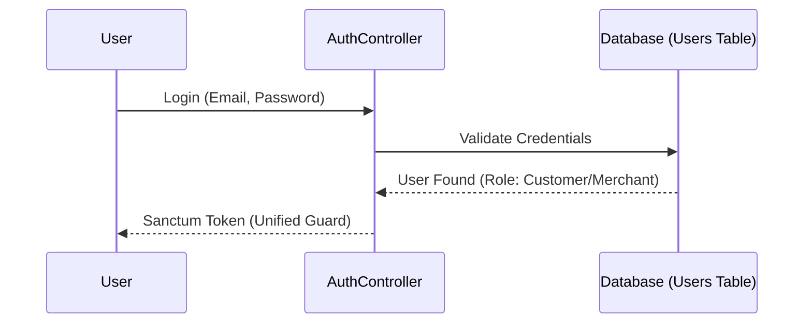
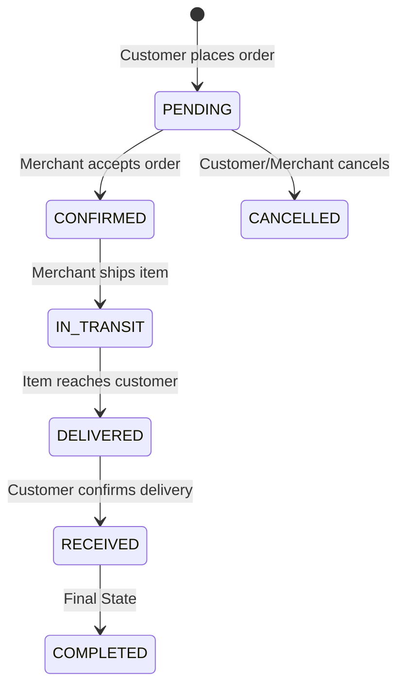

# Icon Shoppers: Renovated System Flow

This document describes the unified and streamlined operational flow of the renovated Icon Shoppers platform.

---

## 1. Unified Identity & Authentication

Unlike the legacy system which split identities into multiple tables, the renovated system uses a **Single Identity System**.

### User Model
All users reside in the `users` table, differentiated by the `role` attribute:
- `customer`: Can browse products, manage cart, place orders, and rate products.
- `merchant`: Owns a shop, manages products, and fulfills orders.
- `admin`: (Optional) System-wide management and oversight.

### Unified Auth Flow

---

## 2. Merchant & Shop Lifecycle

Merchant registration and shop creation are now tightly coupled for a better onboarding experience.

### Shop Ownership
- Every `merchant` user is associated with exactly one `Shop` via the `owner_id` foreign key.
- Shop management (CRUD) is strictly authorized to the owner.

### Merchant Onboarding Flow
1. **Registration**: User signs up with `role => merchant`.
2. **Auto-Provisioning**: The system automatically initializes a `Shop` instance for the user.
3. **Setup**: Merchant updates shop profile (Logo, Description) via `api/profile`.
4. **Listing**: Merchant adds products which are automatically linked to their shop.

---

## 3. Shopping & Checkout Flow

The shopping experience is streamlined around a persistent, database-backed cart tied directly to the user's ID.

### Order Lifecycle

### Checkout Steps
1. **Cart Preparation**: Customer adds items to cart (items grouped by Shop in the UI).
2. **Revalidation**: During checkout, the system re-verifies stock levels and prices.
3. **Order Creation**: One order is created for the customer.
4. **Merchant Notification**: Associated merchants see the new orders in their specific dashboards.

---

## 4. Product Ratings & Feedback

The feedback loop is now tied directly to the unified `User` model.

- **Constraint**: Only customers who have ordered a product can leave a rating (verified via order history).
- **Consolidation**: Ratings use the `user_id` instead of the legacy `customer_id`.
- **System Impact**: Product and Shop rating summaries are updated in real-time or via scheduled jobs to maintain high-quality data for other shoppers.

---

## 5. Summary of Improvements
| Feature | Legacy System | Renovated System |
| :--- | :--- | :--- |
| **User Data** | Split (Customers/Shops tables) | **Unified** (Users table) |
| **Auth Guards** | Multiple (`customer-api`, `shop-api`) | **Single** (`sanctum`) |
| **Shop Relation** | Indirect/Fragmented | **Direct Ownership** (`owner_id`) |
| **Architecture** | Ad-hoc controllers | **Standardized Repositories** |
| **Scalability** | Complex joins across tables | **Clean, optimized relationships** |
