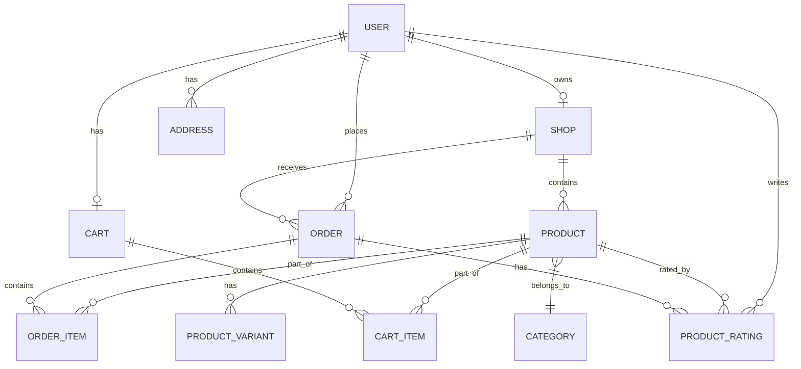

# Schemas & Relationships

This document outlines the database structure and the relationships between different entities in the Icon Shoppers system.

## Database Schema Overview

## Key Entities

### Users (`users`)
- `id`, `name`, `email`, `password`, `role` (customer, merchant, admin), `status`, `phone`, `profile_picture`.
- **Relationships:**
    - `hasOne` Shop
    - `hasMany` Orders
    - `hasMany` Addresses
    - `hasOne` Cart

### Shops (`shops`)
- `id`, `name`, `slug`, `owner_id`, `description`, `logo_image`, `banner_image`, `status`.
- **Relationships:**
    - `belongsTo` User (Owner)
    - `hasMany` Products
    - `hasMany` Orders

### Products (`products`)
- `id`, `shop_id`, `category_id`, `name`, `slug`, `price`, `stock`, `image`, `is_visible`, `is_featured`, `description`.
- **Relationships:**
    - `belongsTo` Shop
    - `belongsTo` Category
    - `hasMany` Variants
    - `hasMany` Ratings

### Orders (`orders`)
- `id`, `user_id`, `shop_id`, `order_number`, `status`, `total_amount`, `subtotal`, `shipping_fee`, `payment_method`, `delivery_method`.
- **Relationships:**
    - `belongsTo` User
    - `belongsTo` Shop
    - `hasMany` OrderItems

### Order Items (`order_items`)
- `id`, `order_id`, `product_id`, `quantity`, `price`, `subtotal`.
- **Relationships:**
    - `belongsTo` Order
    - `belongsTo` Product

### Carts & Cart Items
- **Cart:** `id`, `user_id`.
- **Cart Item:** `id`, `cart_id`, `product_id`, `quantity`.

### Categories (`categories`)
- `id`, `name`, `slug`, `image`.
- **Relationships:**
    - `hasMany` Products
