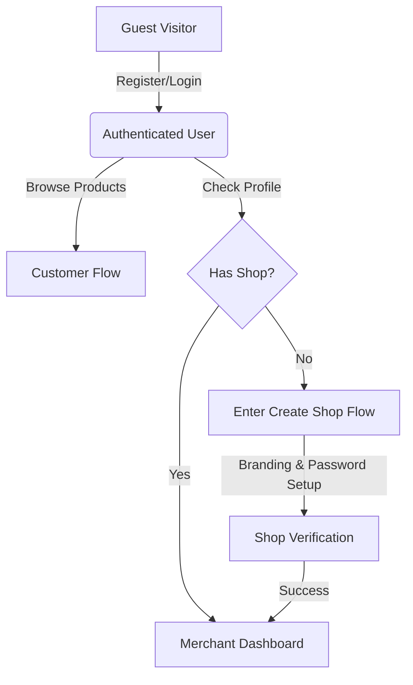

# System Flow

This document describes the core workflows and logic of the Icon Shoppers platform.

## 1. Unified Authentication Flow
Icon Shoppers uses a single-account system. Every registered user is primarily a **Customer**, but can become a **Merchant** by creating a shop.

## 2. Customer Shopping Flow
1. **Discovery:** User browses featured products, top-selling items, or searches for specific products.
2. **Product View:** User views product details, variants, and reviews.
3. **Cart Management:** User adds products to their cart. Cart is stored in the database and persists across sessions.
4. **Checkout:** User initiates checkout, selects delivery method (typically COD in this region), and provides/confirms shipping address.
5. **Order Tracking:** User monitors order status from `ordered` to `completed`.

## 3. Merchant Lifecycle
1. **Shop Setup:** User creates a shop, uploads a logo, and writes a description.
2. **Product Management:** Merchant adds products with images, prices, and stock levels.
3. **Order Fulfillment:** 
    - Receive new orders (`ordered`).
    - Approve/Reject orders.
    - Move to `processing` and then `delivering`.
    - Mark as `delivered` when COD is collected.
4. **Analytics:** Merchant views sales performance and product ratings on their dashboard.

## 4. Order Status Lifecycle
The system follows a strict state machine for orders:

- **ordered:** Initial state when customer checkouts.
- **approved:** Merchant accepts the order.
- **processing:** Order is being packed/prepared.
- **delivering:** Order is in transit to the customer.
- **delivered:** Order has reached the customer.
- **received:** Customer confirms receipt of the items.
- **completed:** Final state, order is finalized.
- **cancelled:** Order was cancelled by customer or rejected by merchant.

## 5. Real-time Communication & Notifications
The system leverages **Laravel Reverb (WebSockets)** for instant updates.

1. **Messaging Flow**:
    - User/Shop sends a message $\rightarrow$ Handled by `MessageController` $\rightarrow$ Triggers `MessageSent` event $\rightarrow$ Broadcasted via private channel $\rightarrow$ Receiver sees message in real-time.
2. **Notification Flow**:
    - Event (Order placed/Sent message) $\rightarrow$ Handled by Notification class (e.g. `OrderPlacedNotification`) $\rightarrow$ Saved to database $\rightarrow$ Broadcasted via `BroadcastChannel` $\rightarrow$ UI updates unread count and shows alert.

## 6. Local Focus
The system is optimized for the **Pinamungajan to Balamban** region. Features like regional address selection and localized shipping rules are central to the flow.
